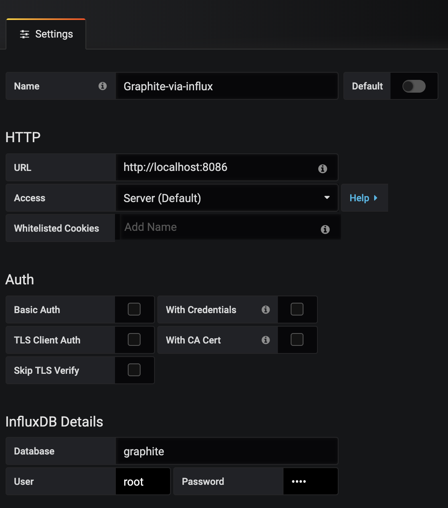

# Knot.x Metrics Grafana board

> Work in progress...

## How to run
### Knot.x instance
Rebuild Knot.x image so that it has embedded Knot.x Dashboard and its configs.

### Run InfluxDB with Graphite enabled
Start the container with InfluxDB + Grafana
Add extra options to running `docker-statsd-influxdb-grafana` container:
```
  -p 2003:2003 \
  -e INFLUXDB_GRAPHITE_ENABLED=true \
```
Full command:
```
docker run --ulimit nofile=66000:66000 \
  -d \
  --name docker-statsd-influxdb-grafana \
  -p 3003:3003 \
  -p 3004:8888 \
  -p 8086:8086 \
  -p 8125:8125/udp \
  -p 2003:2003 \
  -e INFLUXDB_GRAPHITE_ENABLED=true \
  samuelebistoletti/docker-statsd-influxdb-grafana:latest
 ```
### Grafana
1. Add manually new datasource:


2. Import dashboards:
- `knotx-healthcheck.json`
- `knotx-server.json`

## ToDo
- Automatise all manual actions described above
  - Grafana with graphite DS
  - Grafana Knot.x dashboards